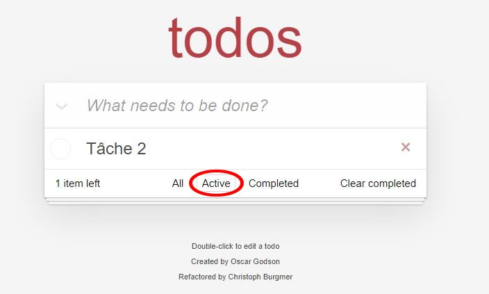
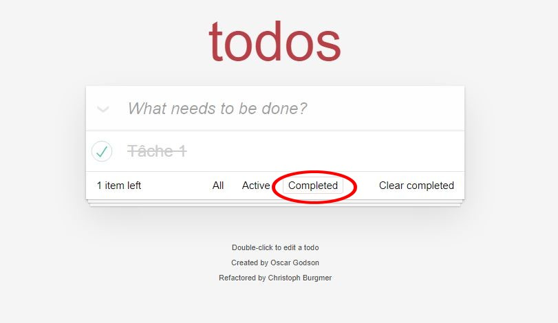
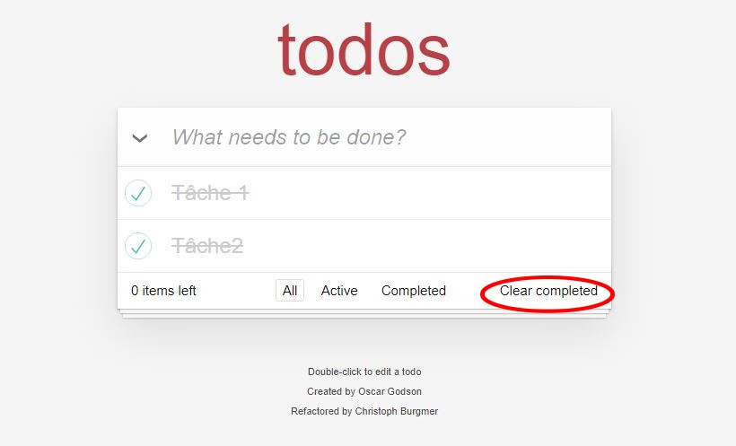

# To-Do List

To-Do List est une application qui as pour but de comme son nom l'indique que faire une liste de tâches à faire.

## Fonctionnalité

### Ajouter une tâche 

Il vous suffit de rentré le texte dans le champs où il est indiqué "What needs to be done ?". Ensuit appuyer sur la touche "Entrée" pour valider la tâches

### Afficher les tâches

#### Afficher toute les taches

Cliquer sur le bouton "All"

#### Afficher les tâches encore à faire

Cliquer sur le bouton "Active"

#### Afficher les tâches validé

Cliquer sur le bouton "Completed"

### Compléter une tâches

Cliquer sur la checkbox vide a côté de la tâches pour la compléter. 
Cliquer sur la checkbox validé a côté de la tâches pour la rendre active.

La flèches vers le bas permet de compléter toutes les tâches en même temps si l'on clique dessus.

### Supprimés les tâches

Lorsque les tâches sont completer (1 ou plusieurs), il est possibles de les supprimer toutes en même temps en cliquant sur "Clear completed"

